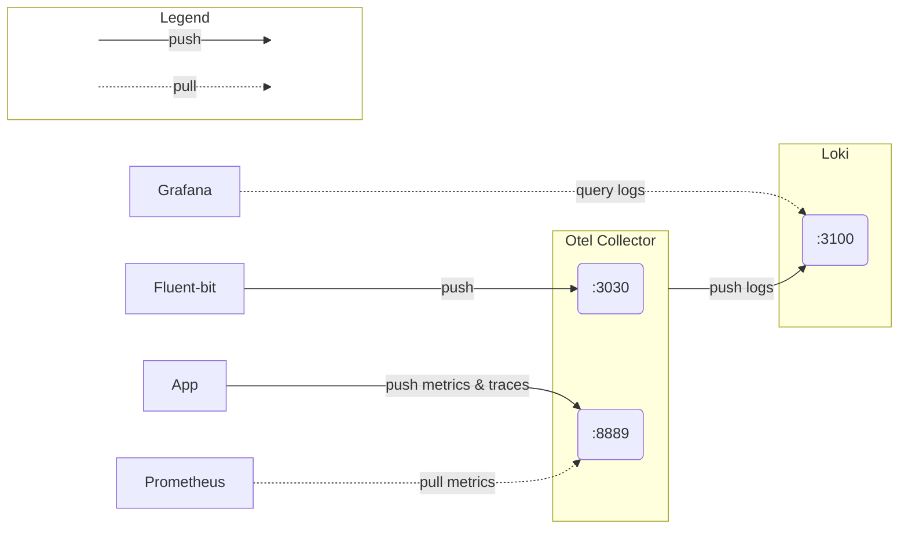

## Debug
```sh
kubectl run curl --image=radial/busyboxplus:curl -i --tty --rm
```

## Cluster Settings
Enable storage for Loki:
```sh
microk8s enable hostpath-storage
```

## Loki
```sh
kubectl port-forward --namespace default svc/loki-gateway 3100:80

export LOKI_ADDR=http://127.0.0.1:3100

logcli labels

logcli query '{exporter="OTLP"}'
```

## Grafana
```sh
# Get admin password
kubectl get secret --namespace default grafana -o jsonpath="{.data.admin-password}" | base64 --decode ; echo

# Port-forwarding
export POD_NAME=$(kubectl get pods --namespace default -l "app.kubernetes.io/name=grafana,app.kubernetes.io/instance=grafana" -o jsonpath="{.items[0].metadata.name}")
kubectl --namespace default port-forward $POD_NAME 3000
```

## Prometheus
```sh
export POD_NAME=$(kubectl get pods --namespace default -l "app.kubernetes.io/name=prometheus,app.kubernetes.io/instance=prometheus" -o jsonpath="{.items[0].metadata.name}")

kubectl --namespace default port-forward $POD_NAME 9090
```

## Resources
### Fluent-bit
- [Filters | Kubernetes](https://docs.fluentbit.io/manual/pipeline/filters/kubernetes)
- [Helm values.yaml](https://github.com/fluent/helm-charts/blob/main/charts/fluent-bit/values.yaml)
- [Inputs | Tail](https://docs.fluentbit.io/manual/pipeline/inputs/tail)
- [Outputs | OpenTelemetry](https://docs.fluentbit.io/manual/pipeline/outputs/opentelemetry)

### OpenTelemetry Collector
- [Loki Exporter](https://github.com/open-telemetry/opentelemetry-collector-contrib/blob/main/exporter/lokiexporter/README.md)
- [Recommended Processors](https://github.com/open-telemetry/opentelemetry-collector/tree/main/processor#recommended-processors)
  - [Batch Processor](https://github.com/open-telemetry/opentelemetry-collector/blob/main/processor/batchprocessor/README.md)
- [Helm values.yaml](https://github.com/open-telemetry/opentelemetry-helm-charts/blob/main/charts/opentelemetry-collector/values.yaml)

### Grafana Loki
- [Loki overview](https://grafana.com/docs/loki/latest/get-started/overview/)
- [Helm values.yaml](https://github.com/grafana/loki/blob/main/production/helm/loki/single-binary-values.yaml)

### Grafana
- [Helm values.yaml](https://github.com/grafana/helm-charts/blob/main/charts/grafana/values.yaml)
